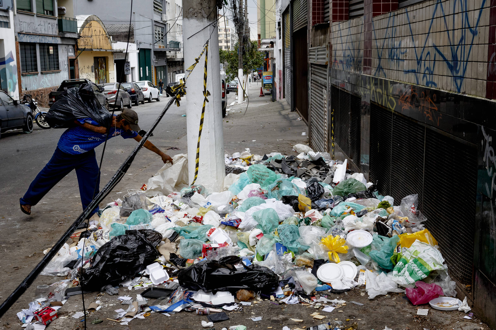
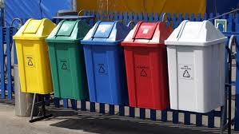

# Street Image Classification Project  

This repository hosts the codebase for a **Python-driven machine learning project** focused on classifying urban street images into three categories: `clean`, `littered`, and `with recycling bins (ecopoints)`. The implementation leverages convolutional neural networks (CNNs), transfer learning, and hyperparameter optimization techniques.  

---

## Technical Implementation  
- **Core Tools**: Python, TensorFlow/Keras, Scikit-learn, OpenCV.  
- **Model Architectures**: Fine-tuned pre-trained CNNs (e.g., ResNet, MobileNet) for feature extraction.  
- **Hyperparameter Optimization**: Compared performance of Particle Swarm Optimization (PSO), Grid Search, and Random Search.  
- **Data Preprocessing**: Balanced class distributions and applied augmentation (rotation, scaling) to mitigate overfitting.  

---

## Dataset Access  
The dataset used in this project is publicly available on [Kaggle](https://www.kaggle.com/datasets/nw8vqlafd/street-classification-dataset). A subset of example images is included in the `dataset/` folder for quick experimentation.  

**Dataset Structure**:  
- **Clean**: Example images of debris-free streets.  
- **Litter**: Images of streets with scattered waste.  
- **Recycle**: Streets featuring recycling bins (ecopoints).  

---

## Language Note  
Code and documentation are primarily in **Portuguese (Portugal)**, but key technical descriptions are provided in English.  

---

# Dataset

The project includes a **dataset** folder that serves as an example of the original dataset used. The dataset is divided into three subfolders:

- **clean**: Images of clean streets.
   
- **litter**: Images of streets with litter.
   
- **recycle**: Images of streets with recycling bins (ecopoints).
   

Each folder contains 5 example images to illustrate the original dataset. For the complete dataset, you can access it on [Kaggle](https://www.kaggle.com/datasets/nw8vqlafd/dataset-ic).

---

## Repository Structure

This repository is organized into the following sections:

### **1. Models (`models/`)**
Contains the trained models saved in `.h5` format. These models were used to classify images into the respective categories:
- **`Grid_SaveModel.h5`**: Model optimized using Grid Search.
- **`PSO_SaveModel.h5`**: Model optimized using Particle Swarm Optimization (PSO).
- **`Random_SaveModel.h5`**: Model optimized using Random Search.
- **`Simple_SaveModel.h5`**: Baseline model without optimization.

### **2. Results (`results/`)**
Holds the performance metrics and results of the models:
- **`Grid_Excel.xlsx`**: Results from the Grid Search optimization.
- **`PSO`**: Results from the PSO optimization.
- **`Random`**: Results from the Random Search optimization.
- **`Simple`**: Results from the baseline model.

### **3. Source Code (`src/`)**
Includes the Jupyter Notebooks and scripts for training the models and performing hyperparameter optimization:
- **`Grid.ipynb`**: Script for training the model with Grid Search optimization.
- **`PSO`**: Script for training the model with PSO optimization.
- **`Random`**: Script for training the model with Random Search optimization.
- **`Simple`**: Script for training the baseline model.

---

## License

This project is licensed under the [MIT License](/LICENSE). Feel free to use, modify, and distribute this project.
